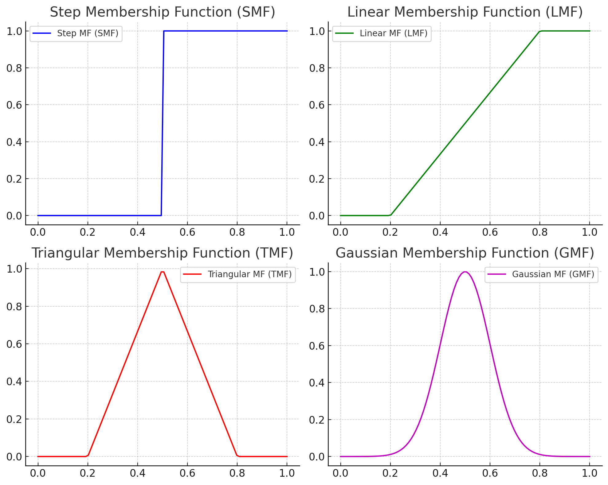
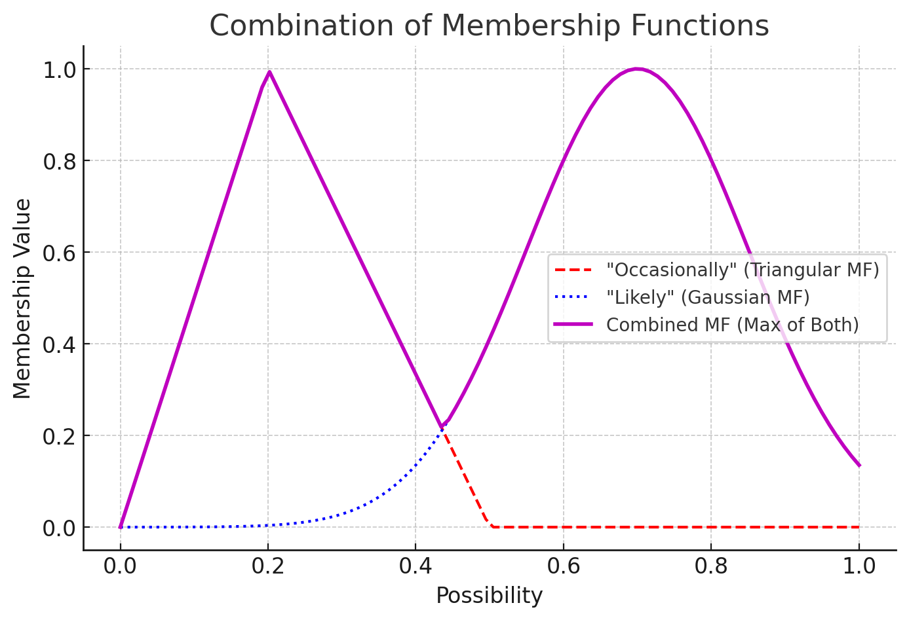

# AI 邏輯整理 (基於 GPT-4o)

## 1. 二元邏輯與模糊邏輯

### 二元邏輯 (Binary Logic)
在傳統的二元邏輯中，所有判斷都是 **非黑即白**，只能是 **真（True, T）** 或 **假（False, F）**：
```
0 = FALSE
1 = TRUE
```

### 模糊邏輯 (Fuzzy Logic)
模糊邏輯允許 **不確定的模糊狀態**，無法以二元方式簡單判斷「是或否」。  
這種概念是 **人工智慧（AI）的核心基礎理論**，應用於機器學習、控制系統等領域。

### 模糊值域
FUZZY 值代表的是 **邏輯為 True 的可能性 P (Possibility)**。
```
0 < P < 1, or
False < Possibility < True
```

### 可能性(P) 與 期望事件數(E)
```
P:  Posibility, 事件為 True 的可能性。
Q:  共軛 P 值, 用於計算 期望事件數(E)。
    Q = 1 - P ; 0 <= P < 0.5
    Q = P     ; 0.5 <= P <= 1
E:  Event, 可能性 P 下的 期望事件數。
    E = 1 / Q
```

| **P** | **Q** | **E** |
|-------|-------|-------|
| 0     | 1.0   | 1     |
| 0.2   | 0.8   | 1.25  |
| 0.5   | 0.5   | 2     |
| 0.7   | 0.7   | 1.43  |
| 1     | 1.0   | 1     |

---

## 2. 模糊邏輯應用
主要目的為將**文字語意量化成可能性數值**，讓機器可以**從數學角度理解語言**。
可能性數值的另一個目的就是取得期望事件數，你可以直觀想成
你說的這句話有多少種可能的結果，有多少可能的未來。

### 頻率 (Frequency)
期望事件數E舉例: 比如 **時常** 表示你有一半的可能不會做這件事，一半的可能總是會做這件事，
因此 `E(時常)=2`。
| **D(單元謂語)** | **P** | **Q** | **E** |
|---|---|---|---|
| 不會 (Not)                     | 0     | 1     | 1     |
| 偶爾 (Occasionally; Sometimes) | 0.2   | 0.8   | 1.25  |
| 時常 (Frequently; Often)       | 0.5   | 0.5   | 2     |
| 經常 (Regularly; Usually)      | 0.8   | 0.8   | 1.25  |
| 總是 (Always)                  | 1     | 1     | 1     |

### 可能性 (Probability)，注意與 P (Possibility) 不同。
期望事件數E舉例: 比如 `E(不一定)=2`，這很直觀，因為**不一定** 代表 **可能** 或 **不可能** 發生。
再比如 **E(幾乎不)=1.11**，不太直觀，你可想成你說出口的事情如果發生 111 遍，
則期望會有 **100件不會發生**，**有11件會發生**。
| **D(單元謂語)** | **P** | **Q** | **E** |
|---|---|---|---|
| 不可能 (Impossible; No chance)            | 0     | 1     | 1     |
| 幾乎不 (Highly unlikely; Barely possible) | 0.1   | 0.9   | 1.11  |
| 有可能 (Possibly; Might; Could)           | 0.3   | 0.7   | 1.43  |
| 不一定 (Fifty-fifty)                      | 0.5   | 0.5   | 2     |
| 很可能 (Likely; Probably)                 | 0.7   | 0.7   | 1.43  |
| 幾乎會 (Highly likely; Very probable)     | 0.9   | 0.9   | 1.11  |
| 必然會 (Certain; Inevitable; Guaranteed)  | 1     | 1     | 1     |

### 模糊隸屬函數(Membership Function, MF)
模糊邏輯的實際值，就是利用各種 **MF** 取得，比如 `MF1(偶爾) = 0.2`, `MF2(偶爾) = 0.3`。常見如下: 
- 階梯函數 (Step Membership Function, SMF)
- 線性函數 (Linear Membership Function, LMF)
- 三角函數 (Triangular Membership Function, TMF)
- 高斯函數 (Gaussian Membership Function, GMF)

### MF 圖形範例


---

## 3. 事件數組合 (AI學習的核心基礎)

### 越模糊的論述有越多的事件數。
注意 **不必然會** 表示 P(不可能+幾乎不+...+幾乎會)，此值至少有三種運算方式，
以下值為 **模糊求合(fsum)** 得到的結果。
| **D(組合謂語)** | **E1** | **E2** | **E(E1xE2)** |
|---|---|---|---|
| 不一定會 (Not always)            | 2    | 1    | **2**      |
| 可能時常 (may often)             | 1.43 | 2    | **2.86**   |
| 偶爾可能 (Sometimes it may)      | 1.25 | 1.43 | **1.7875** |
| 不必然會 (Not Certainly) (fsum)  | 1.12 | 1    | **1.12**   |

### 越清晰的論述有越少的事件數。
| **D(組合謂語)** | **E1** | **E2** | **E(E1xE2)** |
|---|---|---|---|
| 絕對必然 (Absolutly)             | 1    | 1    | **1**      |
| 幾乎必然 (Almostly it would)     | 1.11 | 1    | **1.11**   |
| 幾乎不會 (Almostly it would not) | 1.11 | 1    | **1.11**   |
| 絕對不會 (Absolutly not)         | 1    | 1    | **1**      |

### 混合邏輯的 MF


### 總結: 問題要盡量避免模糊邏輯，越明確(強硬)越好。

---

## 4. huskium 受到的幫助與未來規劃

### CICD 輔助
- git: 上版流程
- pep8: 格式調整
- mypy: 靜態型別檢查
- flake8: 除 mypy 外的靜態檢查
- [sphinx](https://uujohnnyuu.github.io/huskium/): 配合 gh-pages 分支生成 html 文件
- [TestPyPI](https://test.pypi.org/project/huskium/): 正式上 PyPI 前的功能測試
- [PyPI](https://pypi.org/project/huskium/): 正式上 PyPI

### 即時功能變更與技術革新
- python 3.11 以後的重大功能優化 (huskium 已綁定需 v3.11.0 以上)
- Selenium/Appium v4 新功能和bug修正
- ios XCUITest 更新與bug修正
- android UIAutomator2 更新與bug修正

### 套件層面
以下依最重要者先排序
- 程式優化: 諸如更精簡效能更好的寫法
- 新功能建構: 參照最新資訊建構新功能
- 整體架構調整: 目前框架面還是人類較強，我先確立好架構，再逐步提出可優化處讓AI學習判斷
- [TODO]PyPI setup 調整為 pyproject.toml

### 自動生成腳本層面
讓 AI 直接參照 PyPI 專案學習 `page.method()` 和 `page.element.method()` 的建構方式
- 設定手勢: huksytc/testcase/test_flow/test_app_flow/test_draw_gesture
- [TODO]: 腳本邏輯問題不大，但 page object 的建構尚不穩定，目前高達 40% 機率會誤用 By 元素定位邏輯，且會自己建構無效的顯性等待方式。
- [FUTURE1]: 希望能正確建立 page object 並能 100% 正確執行。
- [FUTURE2]: 終極目標很難但試試看 -> 能即時取用 selenium/appium 最新版本更新 huskium 功能與邏輯。

### 手勢設定舉例(UI執行過程請見DEMO影片)
元素變數名稱請 AI 命名成 `someN` 形式，做好保密。
```python
@pytest.mark.p0
@pytest.mark.app
class TestApp:

    def test_draw_gesture(self, iphone, login):

        page = AppPage(iphone)

        # Direct to the gesture setting page.
        page.some1.wait_any_visible()
        page.some2.click()
        page.some3.swipe_by().click()
        page.some4.click()
        page.some5.click()

        # Get the nine-dots and drawing with fail scenario.
        dots = page.dots.centers
        page.draw_gesture(dots, '1235789')  # Z-shape
        page.draw_gesture(dots, '598753215')  # Hourglass
        assert page.some6.is_present()
```
---

## 5. 其他 受到的幫助與未來規劃
內網API框架: 如同先前上版和 wiki 提到的功能，框架面幫助有限，但程式面可以有較多優化。
- python/playwright 共用
- playwright inner fetch 分析調試擴充功能
- 超類可新增的介面提示
- 其他程式面的優化
- [FUTURE1]: 至少建立 mypy return 相關的靜態檢查，此項對於找到潛在 bug 很有幫助。
- [FUTURE2]: 與 huskium 相同，讓其自行建構腳本
- [FUTURE3]: 調查能否直接利用 K6 撰寫自動化腳本即可，壓測腳本參數調整成單位 thread 就是自動化腳本了，可以省去再寫 python 的功夫。
---

## 6. 結論

### A. 問題盡量避免模糊邏輯(禮貌加強硬)，比如
```
官方 logging 有沒有能設置尋找指定 frame 的方法
-> 
「請直接」給我「python」官方 logging 尋找指定 frame「開頭名稱」的方法，「絕對不准」使用魔法函數。
```

### B. 承上，模糊邏輯是AI也是人類思考的根源定律，即使後面AI非常強大，其表現優劣還是取決於人類的指令是否足夠準確。
### C. 人類技術能力越強問法越精準越能直搗核心，避免過多的模糊邏輯與迭代，才能精煉AI的學習效果與產出。

### D. 個人評價目前 GPT-4o 的表現:
| **項目** | **評分(-100~100)** | **理由** |
|---|---|---|
| **綜合評價** | ✅ **70** | **基於人類知識的推演表現良好，但創意不佳且常有幻覺**。建議自身還是要有足夠豐富且正確的辨別能力。期待不遠未來AI能補足剩餘的30分。 |
| 非模糊學習力 | ✅ 70 ~ 95 | **很適合作為窗口查找必要功能與資訊**，但程式學習面尚有很大進步空間。 |
| 模糊前四迭代 | ⭕️ 60 ~ 80 | **前四次迭代大致上都能得到滿意的答案**。如初始指令有較多模糊邏輯，可漸進收斂問題。 |
| 模糊超四迭代 | ❌ **-100** ~ 60 | **超過四次迭代則高機率出現錯誤雜亂資訊(幻覺)**，需盡量避免模糊邏輯。 |
| 程式生成準度 | ⭕️ 59 ~ 95 | **大致表現不錯但深挖技術面還是不少幻覺**，因此自身還是要有豐富且正確的辨別能力。 |
| 程式優化效果 | ✅ 80 ~ 95 | **給予最高好評**，甚至可以學習到未曾學過的資料結構與效能技巧，但還是要有豐富且正確的辨別能力。 |
| 框架建構能力 | ❌ 39 ~ 70 | **目前框架面還是人類較強**，建議自身還是要掌握正確資料結構與資料流的技能，配合 AI 漸進優化。 |